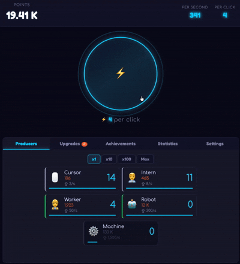

# Idle Clicker Game

A browser-based idle/incremental clicker game built with React, TypeScript, and Vite. Click to earn points, buy producers for passive income, unlock upgrades and achievements, and prestige for permanent bonuses.



## How to Play

**Click** the lightning bolt button to earn points. Use points to buy **producers** that generate points automatically every second. Purchase **upgrades** to multiply your click power and production rates. When progress slows, **prestige** to reset and earn diamonds for permanent bonuses.

## Features

### Core Mechanics

- **Click to earn** -- each click generates points based on your click power
- **10 Producers** -- automated point generators across 10 tiers, from Cursors to Singularities
- **Exponential cost scaling** -- each additional producer costs 15% more than the last
- **30+ Upgrades** across 4 types:
  - **Click upgrades** -- multiply your click power (2x to 5x)
  - **Producer upgrades** -- double specific producer output
  - **Milestone upgrades** -- bonus multipliers for owning 25 or 50 of a producer
  - **Synergy upgrades** -- convert a percentage of your DPS into click power
  - **Global upgrades** -- multiply all production at once

### Bulk Buy

Toggle between buying **x1 / x10 / x100 / Max** producers at once. Prices are calculated using geometric series so you always see the exact total cost.

### Prestige System

Once you've earned enough lifetime points, you can **prestige** -- voluntarily reset your producers and upgrades in exchange for **diamonds**. Diamonds are permanent and persist across resets.

**Diamond formula:** `floor(sqrt(lifetime_earnings / 1,000,000,000))`

Spend diamonds on 6 prestige upgrades:

| Upgrade        | Effect                                         | Max Level |
| -------------- | ---------------------------------------------- | --------- |
| Diamond Aura   | +25% production per level                      | 20        |
| Diamond Touch  | +50% click power per level                     | 20        |
| Head Start     | Start with bonus points after prestige         | 10        |
| Bargain Hunter | -5% producer costs per level                   | 10        |
| Dream Worker   | +10% offline earnings per level                | 10        |
| Lucky Charm    | Golden cookies appear 15% more often per level | 5         |

### Achievements

63 achievements across 4 categories: Clicking, Production, Purchasing, and Prestige. Each unlocked achievement provides a **permanent production bonus** (1-5%), giving you tangible rewards for hitting milestones. Locked achievements show as "???" until discovered.

### Golden Cookies

A golden cookie randomly appears every 2-5 minutes (when you have active production). Click it before it disappears (12 seconds) to activate one of three random effects:

- **Production Frenzy** -- 3x production for 30 seconds
- **Lucky Points** -- instant 30 seconds worth of production
- **Click Frenzy** -- 7x click power for 15 seconds

### Offline Progress

Close the browser and come back later -- the game calculates what you earned while away (at 50% efficiency, up to 8 hours max). A "Welcome Back" dialog shows your offline earnings. The Dream Worker prestige upgrade increases offline efficiency.

### Idle Support

A Web Worker keeps the game running when the tab is out of focus, syncing progress and auto-saving periodically.

### Statistics

Track your progress across:

- **Current Run** -- points earned, time, DPS, click power
- **Lifetime** -- total earned, spent, clicks, time played
- **Prestige** -- total prestiges, highest run, diamonds earned
- **Achievements** -- unlocked count and total bonus percentage

### Settings

- Toggle floating damage numbers and particle effects
- Toggle auto-save
- Switch between suffix (K, M, B) and scientific notation (1.23e6)
- Save / Export / Import / Reset game data

## Producer Tiers

| #   | Producer    | Base DPS     | Base Cost      | Tier      |
| --- | ----------- | ------------ | -------------- | --------- |
| 1   | Cursor      | 1/s          | 15             | Common    |
| 2   | Intern      | 8/s          | 100            | Common    |
| 3   | Worker      | 50/s         | 1,100          | Uncommon  |
| 4   | Robot       | 300/s        | 12,000         | Uncommon  |
| 5   | Machine     | 1,500/s      | 130,000        | Rare      |
| 6   | Factory     | 8,000/s      | 1,400,000      | Rare      |
| 7   | Lab         | 45,000/s     | 20,000,000     | Epic      |
| 8   | Portal      | 250,000/s    | 330,000,000    | Epic      |
| 9   | Time Warp   | 1,500,000/s  | 5,100,000,000  | Legendary |
| 10  | Singularity | 10,000,000/s | 75,000,000,000 | Legendary |

## Development

```bash
pnpm install       # Install dependencies
pnpm start         # Start dev server
pnpm build         # TypeScript check + production build
pnpm test          # Run tests
pnpm lint          # Lint with ESLint
pnpm prettier      # Format code
```

### Deploy

Upload to S3 bucket using aws-cli:

```bash
aws2 s3 sync ./dist s3://bucket-name
```

## Tech Stack

- **React 18** with TypeScript (strict mode)
- **Vite** for build and dev server
- **Valtio** for reactive proxy-based state management
- **Styled Components** for CSS-in-JS theming
- **Web Worker** for background idle processing
- **localStorage** for save persistence (base64 encoded)
