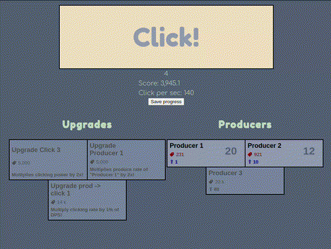

# Clicker game



## Frontend

React app with typescript (http://clicker.klajbar.com/)

### Commands

- yarn start - start dev server
- yarn build - build output into '/dist' folder
- yarn lint - statical code analysis
- yarn prettier - format code

### Deploy

Upload to S3 bucket using aws-cli:

```
aws2 s3 sync ./dist s3://bucket-name
```

## How the game works

The main goal is to collect points.
This can be achieved by either clicking or purchasing producers which will produce points over time.

### Clicking

To collect points by clicking click on the "Click!" button. There are available upgrades to boost clicking power.

### Producers

Producers are available for purchase from the points which was previously collected by clicking. There are several kind of producers. The more they cost the more base damage they will have. Purchasing multiple producers from the same type will boost the damage but will cost more eventually. Upgrades are also available to further boost each kind of producers.

## Web workers

- Uses webworker to handle idle state
  - When tab is out of focus it goes into a hydrated state - timeouts will be executed much slower
  - Webworker is always\* running in the background while the tab is open

## Progress

The app will update frequently the progress and saves it to the localStorage - `clicker.state`
It is also possible to save the progress manually by clicking the "Save progress button"

## TODO

- Create unit tests
- identify parts which could be written more efficiently
- Create cypress tests
